<div align="center">

# PETS ROLL

### Roll eggs. Hatch pets. Collect them all.

A casual idle gacha game with **187 unique collectible pets**, charming cube-style art, and endless rolling fun.

**[Play Now](https://elenarumiru.github.io/roll-pets/)**

---

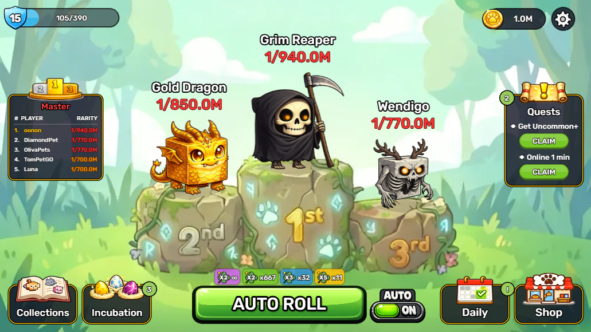

</div>

---

## Meet the Pets

Every pet is a hand-drawn cube-style character with its own personality. From grumpy cats to legendary golden dragons — there's always something new to discover.

<div align="center">

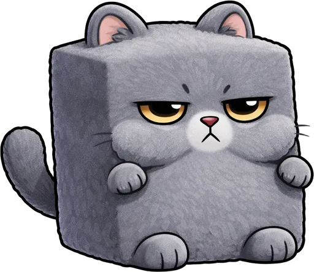 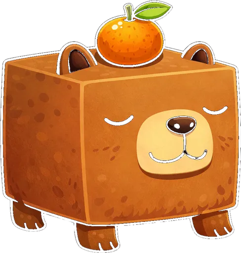 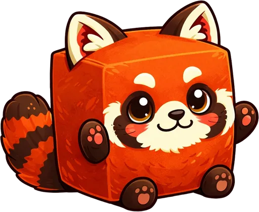    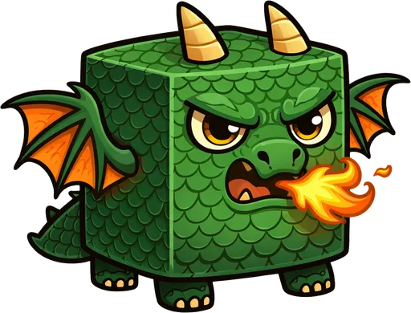 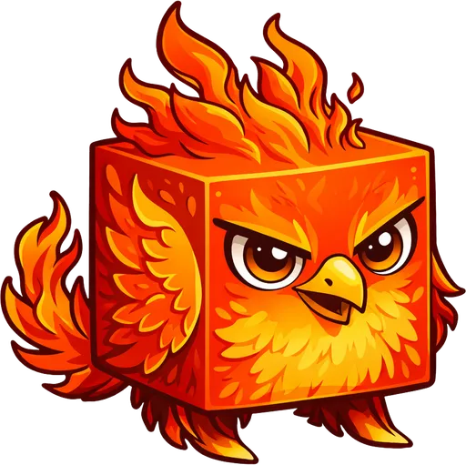 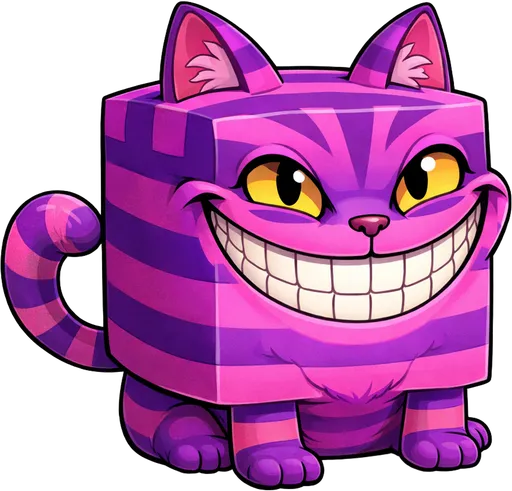 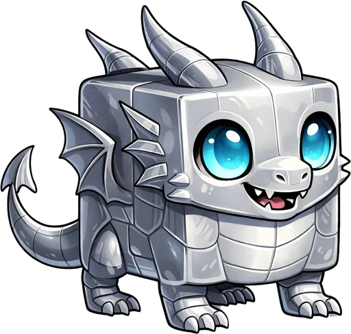 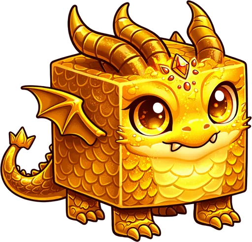 

*Common ... Uncommon ... Rare ... Epic ... Heroic ... Mythic ... Ancient ... Legendary*

</div>

---

## Features

<table>
<tr>
<td width="50%">

### Collection & Discovery
- **187 unique pets** across **11 rarity grades**
- **24 thematic collections** (House Pets, Dragons, Mythical, Undead...)
- Collection rewards for completing sets
- Difficulty ratings: Easy / Medium / Hard

</td>
<td width="50%">

### Progression & Strategy
- **1000 levels** of progression
- **Prestige system** (Rebirth) with permanent luck multipliers
- **Egg incubation** with 17 tiers and 3 nest slots
- Daily quests, daily bonuses, and a refreshing shop

</td>
</tr>
<tr>
<td>

### Luck & Buffs
- Stack Lucky (x2), Super (x3), Epic (x5), and Dream (x100) buffs
- Auto Roll mode for idle gameplay
- League system: Bronze through Master
- Leaderboard rankings

</td>
<td>

### Polished Experience
- Smooth animations and satisfying SFX per grade
- Works on desktop and mobile (responsive 16:9)
- Instant load, no account required
- Localized: English & Russian

</td>
</tr>
</table>

---

## Screenshots

<div align="center">

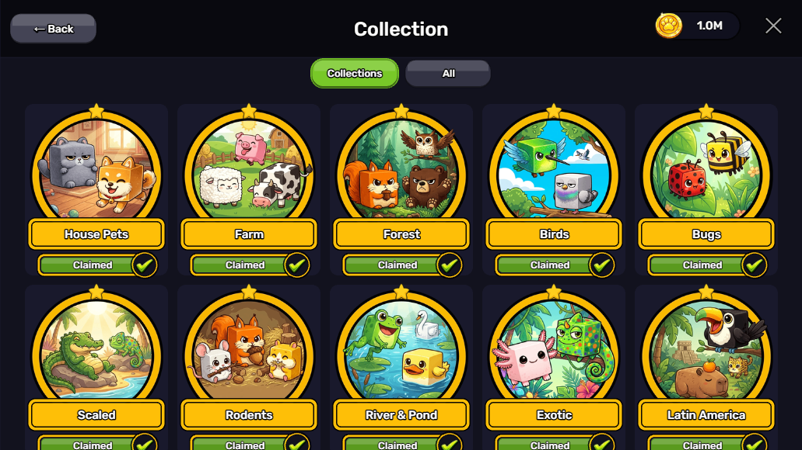 &nbsp;&nbsp; 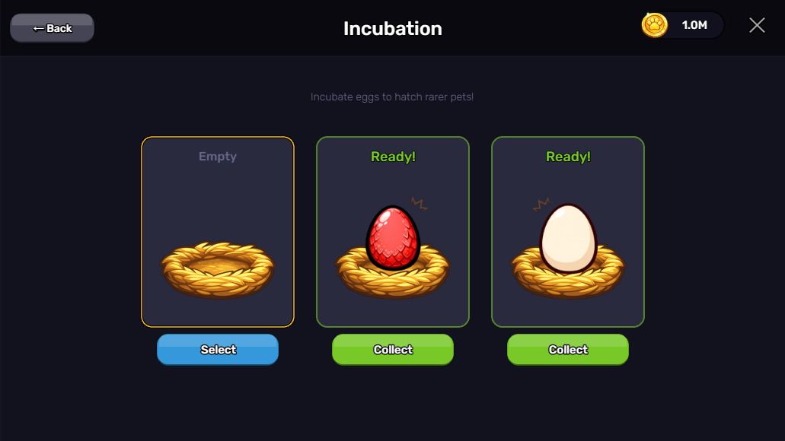

*24 collections to complete &nbsp;&nbsp;&nbsp;&nbsp;&nbsp;&nbsp;&nbsp;&nbsp; Incubate eggs for rarer pets*

</div>

---

## Rarity Grades

| Grade | Pets | Odds | Color |
|:------|:----:|:----:|:-----:|
| Common | 30 | 1 in 2 | Gray |
| Uncommon | 50 | 1 in 100+ | Green |
| Extra | 38 | 1 in 1K+ | Blue |
| Rare | 21 | 1 in 5K+ | Purple |
| Superior | 14 | 1 in 50K+ | Pink |
| Elite | 12 | 1 in 500K+ | Orange |
| Epic | 7 | 1 in 5M+ | Red |
| Heroic | 6 | 1 in 50M+ | Crimson |
| Mythic | 3 | 1 in 250M+ | Gold |
| Ancient | 3 | 1 in 500M+ | Teal |
| **Legendary** | **3** | **1 in 750M+** | **Yellow** |

---

## Tech Stack

| | |
|:--|:--|
| **Engine** | Phaser 3 |
| **Language** | TypeScript (strict, zero `any`) |
| **Bundler** | Vite + Terser |
| **Architecture** | EventBus pattern, composition over inheritance |
| **Bundle size** | < 5 MB |
| **Codebase** | ~33 files, ~2500 lines |

---

## Development

```bash
npm install        # Install dependencies
npm run dev        # Dev server on localhost:8080
npm run build      # Production build to dist/
```

---

<div align="center">

Made with Phaser 3 and a lot of love for cubic pets.

**[Play Pets Roll](https://elenarumiru.github.io/pets-go-lite/)**


</div>
